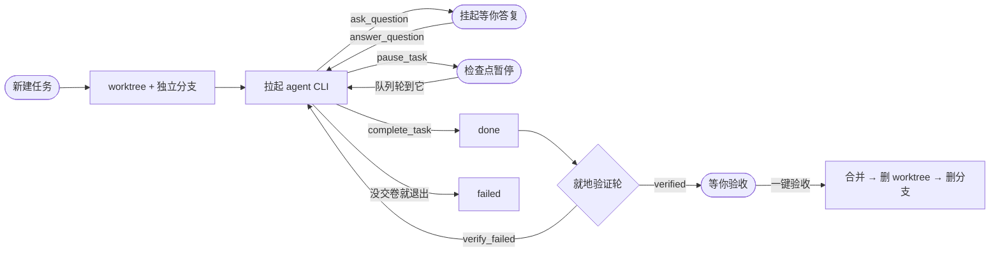

<div align="center">

# Harness

**把 `claude`、`codex` 这些编程智能体 CLI，变成一支你能派活、能盯进度、能验收合并的团队。**

自托管 · 单进程 · 本地优先 —— 一个端口既是界面也是 API，数据全在你自己的磁盘上。

<p>
  
  
  
  
  
  
</p>

[快速开始](#-快速开始) · [它怎么干活](#-它怎么干活) · [支持的执行器](#-支持的执行器) · [架构](#-架构) · [部署与运维](docs/install.md)

</div>

<!-- 截图位：仓库里暂无产品截图。补图时放这里，建议一张任务详情 + 一张验收页。 -->

---

## 这是什么

Harness **自己不写代码**。它是一个调度台：拉起你机器上已经装好、已经登录过的 agent CLI，给它们派活，把每一轮的输出、工具调用、验证证据落盘，最后帮你把合格的改动合回主干。

因为干活的是那些 CLI 自己的登录态，**Harness 里不需要填任何 API key**。

**它解决的是这几件事：**

| 你自己开一堆终端跑 agent 会遇到的 | Harness 的做法 |
|---|---|
| 改动互相踩，不敢并行 | 每个任务一个 git worktree + 独立分支，天然隔离 |
| `exit 0` 了但活其实没干完 | **完成协议**：agent 必须调 `complete_task` 交卷，否则一律记 `failed` |
| 跑完不知道到底行不行 | **就地验证轮**：在同一个任务上多跑一个旁路回合，证据落盘，不合格自动打回续修 |
| 关掉终端 / 重启服务，agent 就没了 | detached spawn + 重启接回，agent 活得过 server 重启 |
| 多个任务的先后顺序全靠脑子记 | 分组 + 队列：串行链自动推进，并行组同时开工，失败的可原地重排 |
| agent 卡住了要问你，但你不在 | 它调 `ask_question` 挂起，你在界面上答复，同一个会话续跑 |
| 合并回主干还得手动 git 一遍 | 一键验收：合并 → 删 worktree → 安全删分支，冲突就叫醒来源任务 |

---

## 🚀 快速开始

**前置**：Node.js ≥ 22.16、git，以及**至少一个已登录过的 agent CLI**。

```bash
npm install -g @anthropic-ai/claude-code  &&  claude   # 登录一次
npm install -g @openai/codex              &&  codex    # 登录一次
```

**装 + 跑**：

```bash
git clone https://github.com/noroot777/ash.git harness
cd harness
npm run setup     # 查环境 → 装依赖 → 构建 → 接上 harness MCP → 列出可派活的 CLI
npm start         # 浏览器开 http://localhost:4317
```

> [!IMPORTANT]
> `npm run setup` 里**接 MCP 那一步不能省**。Harness 里的 agent 是靠 harness MCP 的 `complete_task` 交卷的；MCP 没接上 = agent 根本没有那个工具可调 = 每个任务跑完都是红的。手动接法见 [docs/install.md](docs/install.md)。

**第一次用**：新建项目（填一个 git 仓库的**绝对路径**）→ 新建任务 → 选执行器 → 跑。执行器列表空着也能跑，不选就用该 CLI 的默认配置。

---

## 🧠 它怎么干活



几条值得单独说的：

- **`exit 0` ≠ done。** 正常退出不代表目标达成（报错后退出也是 exit 0）。只有 agent 主动调 `complete_task` 才算交卷 —— 这样队列不会被假完成推着走。
- **验证在任务自己身上跑**，不另起审查任务。证据落在 `data/runs/<taskId>/review/round-<n>/`，打回修复就是同一个会话续跑，上下文不丢。
- **同一条串行队列上至多一个在跑**，失败的会被透明跳过；重新排队时如果它的位置已经被越过，自动挪到队尾，不会插队抢跑。
- **agent 也能编排 agent。** harness MCP 暴露 25 个工具（`dispatch` / `create_task_chain` / `run_task` / `stop_task` / `queue_*` …），所以一个 agent 可以当调度台，自己派一批执行者出去。

### 几种派活形态

| 形态 | 适合 |
|---|---|
| **单飞** | 一个任务一个 agent，最常用 |
| **队列 / 分组** | 有先后依赖的多步活（串行链），或互不相干的批量活（并行组） |
| **团队** | 一个常驻调度台 + 一批执行者，调度台负责拆活、答疑、收口 |
| **Duet** | 两个 agent 协作研讨同一个问题，中间有人工闸口，最后合稿 |
| **自由工作流** | 实现 → 验证 → 打回 → 再验证，跑到你满意为止，验收由你按需触发 |

---

## 🧩 支持的执行器

内置 15 个 CLI 的目录（安装命令、模型档位、思考强度都在里面），界面「设置 → 执行器」可以建 profile 固定模型和思考强度：

`claude` · `codex` · `gemini` · `cursor` · `copilot` · `opencode` · `qwen` · `grok` · `kimi` · `trae` · `kiro` · `kilo` · `qoder` · `antigravity` · `pi`

加一个新的 CLI 是**一个文件**的事，见 [`server/src/executors/catalog/README.md`](server/src/executors/catalog/README.md)。

---

## 🧱 架构

单个 Node 进程（Hono）同时托管 API、SSE 和构建好的前端 —— 没有反代、没有第二个服务、没有容器编排。

```
shared/     前后端共享类型
server/     Hono 后端：API + SSE + 编排单例 + 托管前端 dist
web-next/   React + Vite + Tailwind 前端（主界面，挂在 /）
mcp/        harness MCP server：agent 交卷 / 自助编排的 25 个工具
mobile/     Expo 移动端（看任务、回消息）
scripts/    setup / restart / package，全是 .mjs，三平台通用
docs/       安装运维、事故记录
```

<details>
<summary><b>为什么是这些技术选型</b></summary>

- **SQLite 走 Node 内置的 `node:sqlite`** —— 不是 better-sqlite3、也不再是 libsql。零原生编译，`npm install` 不会因为编译工具链失败；代价是最低 Node 版本抬到 22.16（更早的版本要么没这个模块，要么缺 `setReturnArrays`）。
- **Drizzle** 管 schema 和迁移，启动时自动补列，不需要单独跑迁移命令。
- **SSE 而不是 WebSocket** —— 数据流是单向的（服务端推任务状态、输出、trace），SSE 够用，也能穿过任何反代。
- **平台差异收在 `server/src/platform.ts` 一个文件里**（进程表 / 进程树击杀 / 端口占用者），所以三个平台都能原生跑，Windows 不需要 WSL2。已知的 Windows 能力缺口在那个文件顶部**如实写着**，没有假装抹平。

</details>

---

## ⚙️ 配置

| 环境变量 | 默认 | 用途 |
|---|---|---|
| `PORT` | `4317` | 服务端口（界面和 API 同一个） |
| `HARNESS_DB` | `<仓库>/data/harness.db` | 库文件位置 |
| `HARNESS_LOCAL_OPEN_ROOTS` | 作者机器上的两个路径 | 「在本机打开文件」允许的根目录，冒号分隔。**换机器基本都要重设** |

数据全在仓库里的 `data/`：`harness.db` + `runs/`（每轮正文、trace、验证证据）+ `uploads/`。备份就备份这个目录，换机器整个拷过去即可。`data/` 不入库。

> [!WARNING]
> **默认监听 0.0.0.0 且没有任何鉴权。** 谁能连到这个端口，谁就能派任务、读代码、在这台机器上跑命令。只在信任的网络里用，或前面挡一层反代 + 认证。这是自托管单人工具的既定取舍，不是配置疏漏。

---

## 🛠️ 开发

```bash
npm run dev        # 后端 :4317 + Vite :5173（代理 /api 到后端），改前端热更新
npm run build      # 构建 shared + web-next + server + mcp
npm run restart    # 构建 + 后台常驻（关掉终端也活着）
npm run package    # 打分发包，只含入库文件，绝不含 data/
```

前端改完只需 `npm run build`：server 是**从磁盘读** `web-next/dist` 的，不用重启。

回归测试按主题拆在 `server/scripts/test-*.ts`，单独跑：

```bash
npm -w server run test:queue        # 队列推进、透明跳过、重排位置
npm -w server run test:accept-merge # 验收合并、冲突叫醒来源任务
npm -w server run test:detached     # agent 活得过 server 重启
npm -w server run test:review       # 验证轮编排与证据落盘
```

> [!CAUTION]
> `test:queue` 这类端到端用例会**真的 spawn agent CLI**，烧真实额度。

---

## ❓FAQ

<details>
<summary><b>任务跑完全是红的 <code>failed</code>，日志里又没报错</b></summary>

MCP 没接上，agent 没有 `complete_task` 可调。`claude mcp list` 应该看到 `harness: … ✔ Connected`。

</details>

<details>
<summary><b>界面打得开，但一片空白 / 样式是旧的</b></summary>

`web-next/dist` 没构建或过期，跑一次 `npm run build`（不用重启 server）。

</details>

<details>
<summary><b>派任务立刻 ENOENT</b></summary>

那个 CLI 没装，或者不在 server 进程的 PATH 里 —— 从 GUI 启动的进程 PATH 常常更短，用终端起服务。

</details>

<details>
<summary><b>Windows 上建 worktree 报 <code>Filename too long</code></b></summary>

撞了 MAX_PATH(260)，两个开关缺一不可：管理员 PowerShell 里开 `LongPathsEnabled`，再 `git config --global core.longpaths true`（Git for Windows 走自带 msys 运行时，**不看**系统开关）。`npm run setup` 会替你查这两条。

</details>

<details>
<summary><b>能不能再起一个隔离实例来试？</b></summary>

同一个库上有单例锁（粒度是 DB 文件路径，不是端口）。换库就能并存：`PORT=4318 HARNESS_DB=/tmp/x.db npm start`。

</details>

更多排错见 [docs/install.md](docs/install.md)。

---

## 📚 文档

| | |
|---|---|
| [docs/install.md](docs/install.md) | 装到别的机器、MCP 接线、日常运维、排错 |
| [docs/incidents.md](docs/incidents.md) | 事故经过、踩过的坑、被证伪的路 |
| [docs/windows-testing.md](docs/windows-testing.md) | Windows 上的测试基线 |
| [AGENTS.md](AGENTS.md) | 所有执行器都要遵守的仓库约定 |
